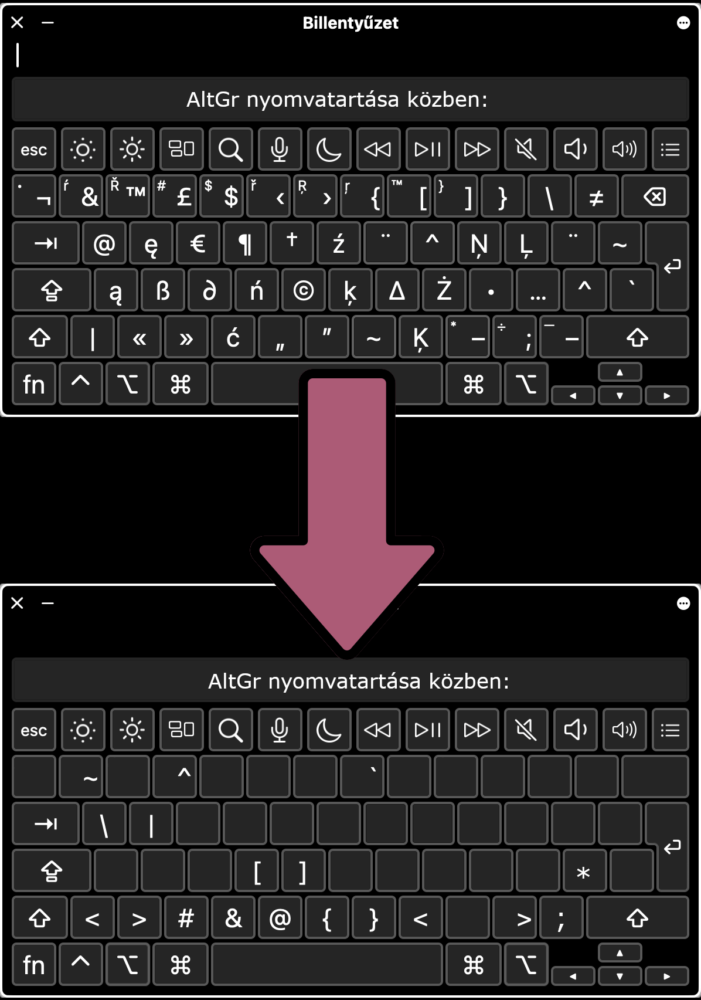

# Apple Hungarian Layout to PC Hungarian Layout Visual Studio Code Extension

This VSCode extension replaces special characters when you type on Apple’s Hungarian keyboard layout with the original characters present on a regular 101-key Hungarian keyboard, fixing the layout.

*The only differences are these characters: type `*` with `AltGr + á`, and type `;` with `AltGr + -`. These cannot be set to their original places due to limitations in how the OS sends key events.*



**License**

This project is licensed under the [GNU General Public License v3.0 or later](https://www.gnu.org/licenses/gpl-3.0.html).

**Links**

- [GitHub Repository](https://github.com/hlorand/apple-hun-to-pc-hun-vscode)
- [Marketplace URL: Apple Hungarian Layout to PC Hungarian](https://marketplace.visualstudio.com/items?itemName=hlorand.apple-hungarian-layout-to-pc-hungarian) 
- [Marketplace Management Dashboard](https://marketplace.visualstudio.com/manage/publishers/hlorand)
- [Azure DevOps Organization](https://dev.azure.com/hlorand)
  - [Manage Personal Access Tokens](https://dev.azure.com/hlorand/_usersSettings/tokens)
- [HUB URL](https://marketplace.visualstudio.com/manage/publishers/hlorand/extensions/apple-hungarian-layout-to-pc-hungarian/hub)
- [Publishing Guide](https://code.visualstudio.com/api/working-with-extensions/publishing-extension)
- [Alternative helpful extension](https://marketplace.visualstudio.com/items?itemName=sporiley.symbol-complete)

**Dev commands**

```bash
vsce package # Package the extension
vsce publish # Publish the extension to the marketplace
```